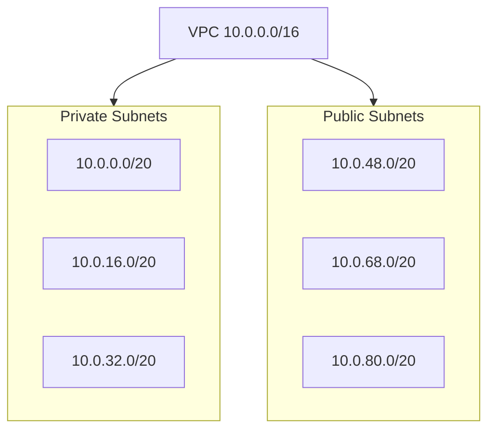
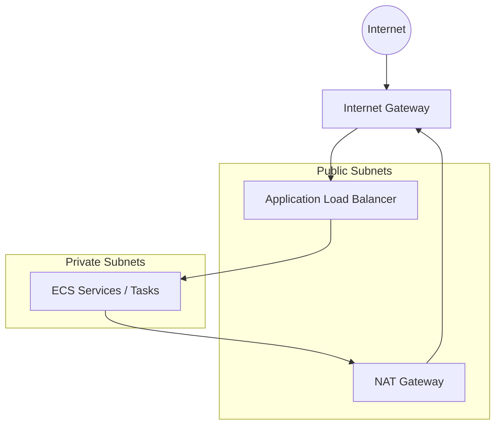

# Overview

Deploy a containerized Ruby on Rails API to cloud infrastructure, automate delivery, and expose it publicly.

## API

The app lives in `/api` directory and exposes:

- `GET /health` → `{"status":"ok"}`

## Requirements Coverage

- [x] Containerized Rails API that builds and runs with Docker
- [x] Infrastructure provisioned with Terraform/Terragrunt
- [x] Automated CI/CD with GitHub Actions on `main`.

## Repository Structure

```
.
├── api                                           # ruby on rails api app
│   ├── Dockerfile
│   ├── ...
├── gitops                                        # gitops config
│   └── terraform
│       ├── catalog
│       │   ├── modules                           # the reusable modules
│       │   │   └── ...
│       │   └── units                             # terragrunt units
│       │   │   └── ...
│       └── live                                  # where all environments live (based on the tier and the region)
│           ├── dev
│           │   └── eu-central-1
│           │       ├── env.hcl
│           │       ├── region.hcl
│           │       └── terragrunt.stack.hcl
│           ├── env.hcl
│           └── root.hcl
├── .github
│   ├── dependabot.yml                            # manage dependencies and create PRs for the versions updates
│   └── workflows
│       ├── aws-ecr.yaml                          # workflow to build and artifact and push it to the ecr
│       └── ci.yml                                # a workflow to validate on the codebase
├── mise.toml                                     # the virtual env manager
```

## High Level Infrastructure Architecture for HA

### CIDR / Subnet Layout Diagram


### Network High level Architecture


## Prerequisites

- Docker
- Ruby `3.4.8`
- Terraform `1.14.6`
- Terragrunt `0.95.0`
- AWS CLI `2.x`

Tool versions are pinned in `mise.toml`.

## Local Run

### Run with Rails

```sh
cd api
bundle install
bin/rails server
```

Health check:

```sh
curl http://localhost:3000/health
```

### Run with Docker

```sh
cd api
docker build -t fundingpips-api .
docker run --rm -p 8080:80 fundingpips-api
```

Health check:

```sh
curl http://localhost:8080/health
```

## Infrastructure (Terragrunt)

Live environment path:

```sh
cd gitops/terraform/live/dev/eu-central-1
```

Initialize:

```sh
terragrunt run --all init
```

Plan:

```sh
terragrunt run --all plan
```

Apply:

```sh
terragrunt run --all apply
```

The stack definitions are in `terragrunt.stack.hcl` and include terraform state backend, ECR, GitHub OIDC, VPC, EKS, and ECS units.

## CI/CD

GitHub Actions workflows:

- `ci.yml`: PR/push checks for security, linting, tests, and system tests (`api/**` changes)
- `aws-ecr.yaml`: on `main`, builds Docker image, uploads artifact, and pushes tags to AWS ECR

Additional automation:

- `dependabot.yml` for dependency updates

## Demo Cost Estimation

Based on a demo Infracost estimate:

```
Project: .terragrunt-stack-api-ecs
Module path: .terragrunt-stack/api-ecs

 Name                                                                                                                             Monthly Qty  Unit              Monthly Cost

 module.autoscaling.aws_autoscaling_group.idc[0]
 └─ module.autoscaling.aws_launch_template.this[0]
    ├─ Instance usage (Linux/UNIX, on-demand, t3.medium)                                                                                1,460  hours                   $70.08
    └─ EC2 detailed monitoring                                                                                                             14  metrics                  $4.20

 module.alb.aws_lb.this[0]
 ├─ Application load balancer                                                                                                             730  hours                   $19.71
 └─ Load balancer capacity units                                                                                               Monthly cost depends on usage: $5.84 per LCU

 aws_cloudwatch_log_group.ecs
 ├─ Data ingested                                                                                                              Monthly cost depends on usage: $0.63 per GB
 ├─ Archival Storage                                                                                                           Monthly cost depends on usage: $0.0324 per GB
 └─ Insights queries data scanned                                                                                              Monthly cost depends on usage: $0.0063 per GB

 module.ecs.module.cluster.aws_cloudwatch_log_group.this[0]
 ├─ Data ingested                                                                                                              Monthly cost depends on usage: $0.63 per GB
 ├─ Archival Storage                                                                                                           Monthly cost depends on usage: $0.0324 per GB
 └─ Insights queries data scanned                                                                                              Monthly cost depends on usage: $0.0063 per GB

 module.ecs.module.service["inputs-infracost-mock-44956be29f34"].module.container_definition.aws_cloudwatch_log_group.this[0]
 ├─ Data ingested                                                                                                              Monthly cost depends on usage: $0.63 per GB
 ├─ Archival Storage                                                                                                           Monthly cost depends on usage: $0.0324 per GB
 └─ Insights queries data scanned                                                                                              Monthly cost depends on usage: $0.0063 per GB

 Project total                                                                                                                                                         $93.99

──────────────────────────────────
Project: .terragrunt-stack-container-registry
Module path: .terragrunt-stack/container-registry

 Name                                   Monthly Qty  Unit  Monthly Cost

 module.ecr.aws_ecr_repository.this[0]
 └─ Storage                             not found

 Project total                                                    $0.00

──────────────────────────────────
Project: .terragrunt-stack-github-workflows-ecr-oidc
Module path: .terragrunt-stack/github-workflows-ecr-oidc

 Name           Monthly Qty  Unit  Monthly Cost

 Project total                            $0.00

──────────────────────────────────
Project: .terragrunt-stack-main-vpc
Module path: .terragrunt-stack/main-vpc

 Name                                   Monthly Qty  Unit              Monthly Cost

 module.vpc.aws_nat_gateway.this[0]
 ├─ NAT gateway                                 730  hours                   $37.96
 └─ Data processed                   Monthly cost depends on usage: $0.052 per GB

 module.vpc.aws_eip.nat[0]
 └─ IP address (if unused)                      730  hours                    $3.65

 Project total                                                               $41.61

──────────────────────────────────
Project: .terragrunt-stack-terraform-backend
Module path: .terragrunt-stack/terraform-backend

 Name                                                  Monthly Qty  Unit                    Monthly Cost

 aws_dynamodb_table.dynamodb_tfstate_lock
 ├─ Write capacity unit (WCU)                                    5  WCU                            $2.89
 ├─ Read capacity unit (RCU)                                     5  RCU                            $0.58
 ├─ Data storage                                 Monthly cost depends on usage: $0.31 per GB
 ├─ On-demand backup storage                     Monthly cost depends on usage: $0.12 per GB
 ├─ Table data restored                          Monthly cost depends on usage: $0.18 per GB
 └─ Streams read request unit (sRRU)             Monthly cost depends on usage: $0.000000245 per sRRUs

 module.s3_bucket_backend.aws_s3_bucket.this[0]
 └─ Standard
    ├─ Storage                                   Monthly cost depends on usage: $0.0245 per GB
    ├─ PUT, COPY, POST, LIST requests            Monthly cost depends on usage: $0.0054 per 1k requests
    ├─ GET, SELECT, and all other requests       Monthly cost depends on usage: $0.00043 per 1k requests
    ├─ Select data scanned                       Monthly cost depends on usage: $0.00225 per GB
    └─ Select data returned                      Monthly cost depends on usage: $0.0008 per GB

 Project total                                                                                     $3.47

 OVERALL TOTAL                                                                                  $139.07

*Usage costs can be estimated by updating Infracost Cloud settings, see docs for other options.

──────────────────────────────────
216 cloud resources were detected:
∙ 13 were estimated
∙ 202 were free
∙ 1 is not supported yet, see https://infracost.io/requested-resources:
  ∙ 1 x aws_ecs_capacity_provider

┏━━━━━━━━━━━━━━━━━━━━━━━━━━━━━━━━━━━━━━━━━━━━━━━━━━━━┳━━━━━━━━━━━━━━━┳━━━━━━━━━━━━━┳━━━━━━━━━━━━┓
┃ Project                                            ┃ Baseline cost ┃ Usage cost* ┃ Total cost ┃
┣━━━━━━━━━━━━━━━━━━━━━━━━━━━━━━━━━━━━━━━━━━━━━━━━━━━━╋━━━━━━━━━━━━━━━╋━━━━━━━━━━━━━╋━━━━━━━━━━━━┫
┃ .terragrunt-stack-api-ecs                          ┃           $94 ┃           - ┃        $94 ┃
┃ .terragrunt-stack-container-registry               ┃         $0.00 ┃           - ┃      $0.00 ┃
┃ .terragrunt-stack-github-workflows-ecr-oidc        ┃         $0.00 ┃           - ┃      $0.00 ┃
┃ .terragrunt-stack-main-vpc                         ┃           $42 ┃           - ┃        $42 ┃
┃ .terragrunt-stack-terraform-backend                ┃            $3 ┃           - ┃         $3 ┃
┗━━━━━━━━━━━━━━━━━━━━━━━━━━━━━━━━━━━━━━━━━━━━━━━━━━━━┻━━━━━━━━━━━━━━━┻━━━━━━━━━━━━━┻━━━━━━━━━━━━┛
```
